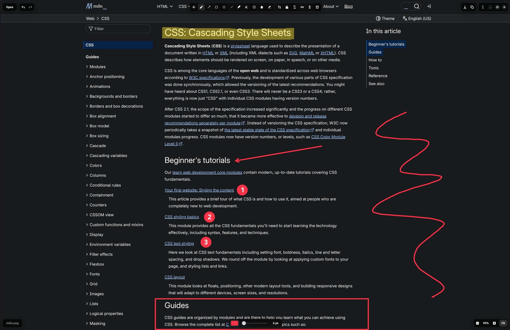

# Swash

Swash is a fast screenshot annotator and lightweight image editor for Linux,
built with GTK 4 and libadwaita.

<p align="center">
  
</p>

## Features

- Freehand drawing, highlighting, text, arrows, shapes, and numbered markers
- Cropping, rotation, flipping, blurring, and annotation erasing
- Moveable annotations with configurable colors, fills, and sizes
- Undo and redo history
- OCR text recognition through Tesseract
- Copy to the clipboard or save to a file
- Open image files or read image data from standard input

## Installation

### Arch Linux

Install Swash from the AUR:

```bash
yay -S swash
```

### Build from source

Required dependencies:

- Meson
- Ninja
- pkg-config
- GTK 4
- libadwaita 1.6 or newer
- A C compiler such as GCC or Clang

Tesseract is optional and enables OCR support.

Configure, build, and install Swash into `/usr/local`:

```bash
meson setup build --buildtype=release
meson compile -C build
sudo meson install -C build
```

The application ID is `dev.lemmy.swash`.

## Usage

Launch Swash without an image:

```bash
swash
```

Show command-line options or the installed version:

```bash
swash --help
swash --version
```

Open an existing image:

```bash
swash path/to/image.png
```

Pipe image data directly into Swash:

```bash
grim -g "$(slurp)" - | swash
```

Use `--stdin` explicitly and set the suggested filename for saving:

```bash
grim -g "$(slurp)" - | swash --stdin --name "Screenshot.png"
```

## Acknowledgements

Swash is a fork of [Waytator](https://github.com/faetalize/waytator).

## License

Swash is licensed under the [GNU General Public License v3.0 or later](LICENSE).
